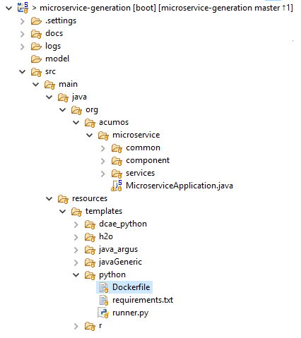
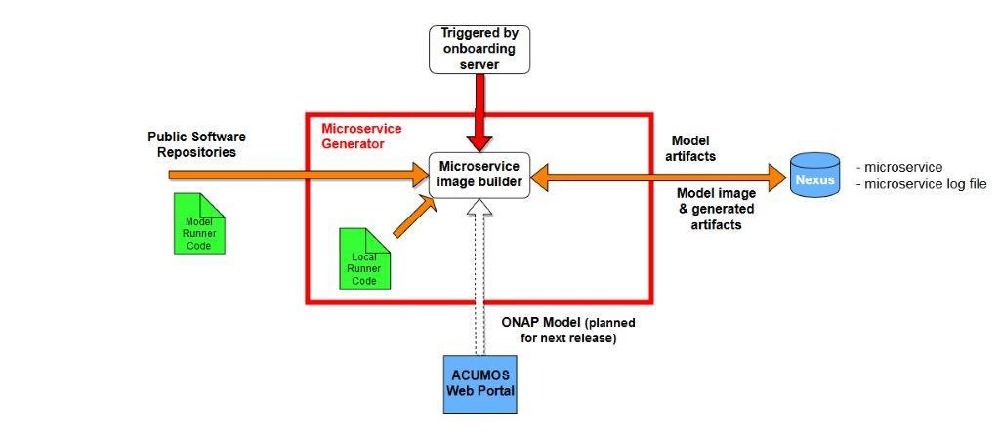

.. ===============LICENSE_START=======================================================
.. Acumos CC-BY-4.0
.. ===================================================================================
.. Copyright (C) 2017-2018 AT&T Intellectual Property & Tech Mahindra. All rights reserved.
.. ===================================================================================
.. This Acumos documentation file is distributed by AT&T and Tech Mahindra
.. under the Creative Commons Attribution 4.0 International License (the "License");
.. you may not use this file except in compliance with the License.
.. You may obtain a copy of the License at
..
.. http://creativecommons.org/licenses/by/4.0
..
.. This file is distributed on an "AS IS" BASIS,
.. WITHOUT WARRANTIES OR CONDITIONS OF ANY KIND, either express or implied.
.. See the License for the specific language governing permissions and
.. limitations under the License.
.. ===============LICENSE_END=========================================================

=======================================
Microservice Generation Developer Guide
=======================================

This is the developers guide to microservice generation.

**1.1 What is microservice generation?**

Acumos is intended to enable the use of a wide range of tools and
technologies in the development of machine learning models including
support for both open sourced and proprietary toolkits. Models can be
easily onboarded and wrapped into containerized microservices which are
interoperable with many other components. 

The goal of microservice generation component is to provide an interface to 
create a wrapper microservice for the models onboarded in Acumos and containerize it 
along with all the run time dependencies of the model.   .

**1.2 Target Users**

This guide is targeted towards the open source user community that:

1. Intends to understand the backend functionality of the microservice generation.

2. Intends to contribute code to enhance the functionality of the microservice generation.

**1.3 Assumptions**

It is assumed that the ML Models contributed by the open source
community:

1. Provide the basic request response style of communication.

2. Can be converted in Microservices

3. Are capable of communicating via Http REST mechanism.

4. Are developed in Java, Python 3.0, R and sourced from toolkits such as Scikit, TensorFlow, H2O, and RCloud.

5. Model is successfully onboarded in Acumos and Model artifacts are available in Acumos Nexus repository.
Artifacts include - Model binary, Protobuf definition for model input/output and service, Metadata.json along 
with Tosca generator files.

**1.4 Microservice generation Design Architecture**

|image0|

Microservice generation exposes API that accepts solution ID for onboarded model, downloads model artifacts and builds
docker image for the model. Docker image is pushed to Nexus repository along with log for the dockerization of the model microservice.

|image1|

**1.5 Microservice generation Low Level Design**

Modeler/Data scientist creates model using toolkit. Modeler uses
Acumos-client-library to push the model to  Acumos platform. The client
library uploads model and metadata file to  Acumos onboarding
server.Onboarding server solution, puts model and metadata
artifact to repository. Model solution ID is accepted by Microservice generation API.
Microservice generation downloads model artifacts - Model binary, protobuf file and metadata.json from Nexus.
It parses metdata, creates a docker image and deploys all dependent libraries in docker container. It also deploys model binary in 
the container. Once docker image is created successfully it is uploaded to Nexus. It logs steps for dockerization and uploads the log as well to Nexus repository. This log is available for user to download and verify docker container or identify issues if dockerization is unsuccessful.

|image2|

**1.6 Onboarding Use Case**

Below, the data scientist’s model is wrapped to produce a standardized
native model. Depending on the input model, only a subset of 
standard model interfaces may be supported.  

Acumos can then generate a microservice however it wishes. The
underlying generic server can only interface with the inner model via
the wrapper. This decoupling allows us to iterate upon and improve the
wrapper independently of Acumos.

|image3|

**1.7 Microservice generartion Model Artifact**

Model artifacts must provide sufficient metadata that enables  Acumos to 
instantiate runtimes, generate microservices, and validate microservice 
compositions. The proposed solution is to split the model artifact into
public and private  components.

- Public

- Understood by  Acumos. Includes metadata on:

- Model methods and signatures

- Runtime information

- Private

- Opaque to  Acumos but understood by the wrapper library.

- Includes: Serialized model

- Auxiliary artifacts required by wrapper library

- Auxiliary artifacts required by model

By splitting the artifact into public and private pieces, the wrapper
library has the freedom to independently iterate and improve.

|image4|

**1.8 Microservice generartion Setup**

Steps:

1. Clone the code from Gerrit Repo:

Repo URL: https://gerrit.acumos.org

Under the dashboard page we have list of Projects,select Microservice generartion
Project and clone this project by using below clone command:

git clone ssh://<GERRIT_USER_NAME>@gerrit.acumos.org:29418/microservice-generation

2. **After cloning import this project in your recommended IDE like STS.**

3. Take the maven update so that you can download all the required
   dependencies for the Microservice generartion Project.

4. After doing maven update you can run or debug the code by using
   Spring Boot App but before that we need to set the Environment
   Variables in our IDE tool for local testing and if you want to read
   the environment variables once you deployed your code on the dev or
   IST server than you need to set all the environment variables in
   system-integration Project.

**1.9 Microservice generartion Technology & Framework**

-  Java 1.8

-  Spring Boot

-  Spring REST

-  Docker Java Library

**1.10 Microservice generartion – Code Walkthrough & details**

In Microservice generartion project we have template folder under resources where we
are putting all the Docker file with some other dependencies for
different Models like h20,java_argus,java_genric,,python,r ,etc.

For example:

For Microservice generartion H20 model we have the h20 Docker file and requirement.txt
file attached below inside h20 folder.

Microservice generartion code understands this Docker file related to particular model
line by line it reads the commands and performs the action accordingly.
It will download all the required dependences accordingly.

Note: Make sure the Docker is installed in the local Machine before try
to Onboard the model in by using our local machine Environment.

**1.11 Microservice generartion – Docker Image Creation and details**

The Microservice generartion server exposes REST API for creating a docker image for a model onboarded in Acumos.

API accepts solution ID for the model in Acumos. The metadata JSON, Model binary and protobuf definition file are downloaded 
from the repository. The model metadata is used to get the runtime version
information, for example python 3.5. This information is used to fetch
the runtime template. The runtime template contains template for
following files.

1.Dockerfile

2.requirements.txt

3.app.py

4.swagger.yaml

Below is the structure:

|image5|

The above template files are populated based on metadata JSON uploaded
by user. Microservice generartion server uses docker-java library for model docker
image creation. Once the docker image is created, the image is tagged
and pushed to nexus docker registry.The server uses common data
micro-services API to create solution and store model and metadata to
artifact repository.

**1.13 Microservice generartion Backend API**

-generateMicroservice:

This API is used for actual Microservice and docker image generartion for models after successful authentication
of token (APIToken or JWTtoken) shared by user.

.. |image0_old| image:: ./media/DesignArchitecture.png
   :width: 5.64583in
   :height: 5.55208in
.. |image1| image:: ./media/HighLevelFlow.png
   :width: 6.26806in
   :height: 1.51389in
.. |image2| image:: ./media/LowLevelDesign.png
   :width: 6.26806in
   :height: 2.43333in
.. |image3| image:: ./media/UseCase.png
   :width: 6.26806in
   :height: 3.0375in
.. |image4| image:: ./media/ModelArtifact.png
   :width: 6.26806in
   :height: 2.5in

